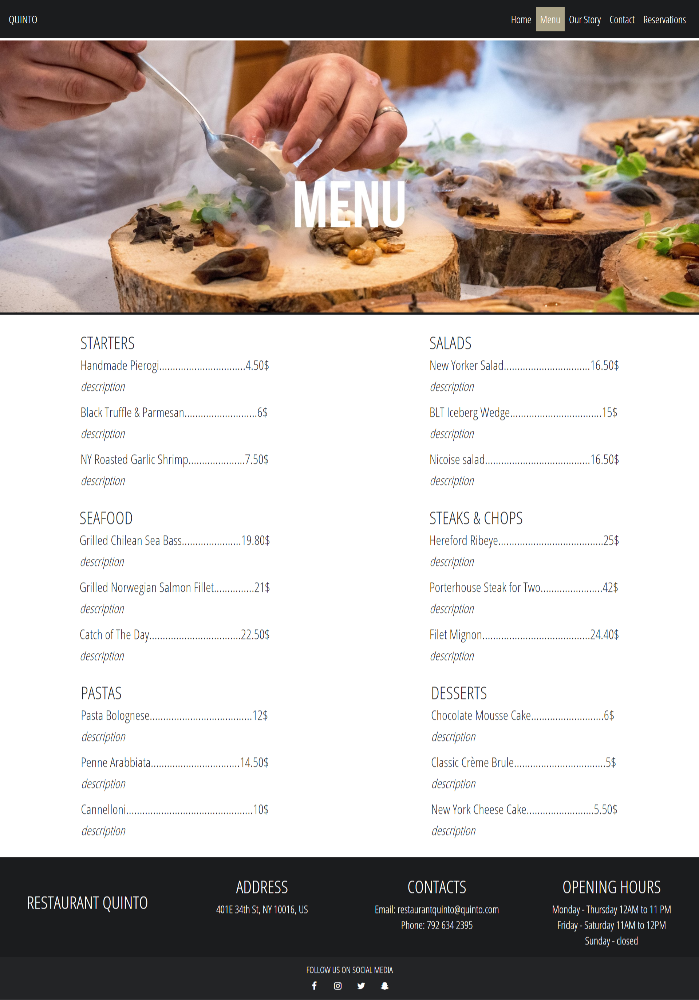
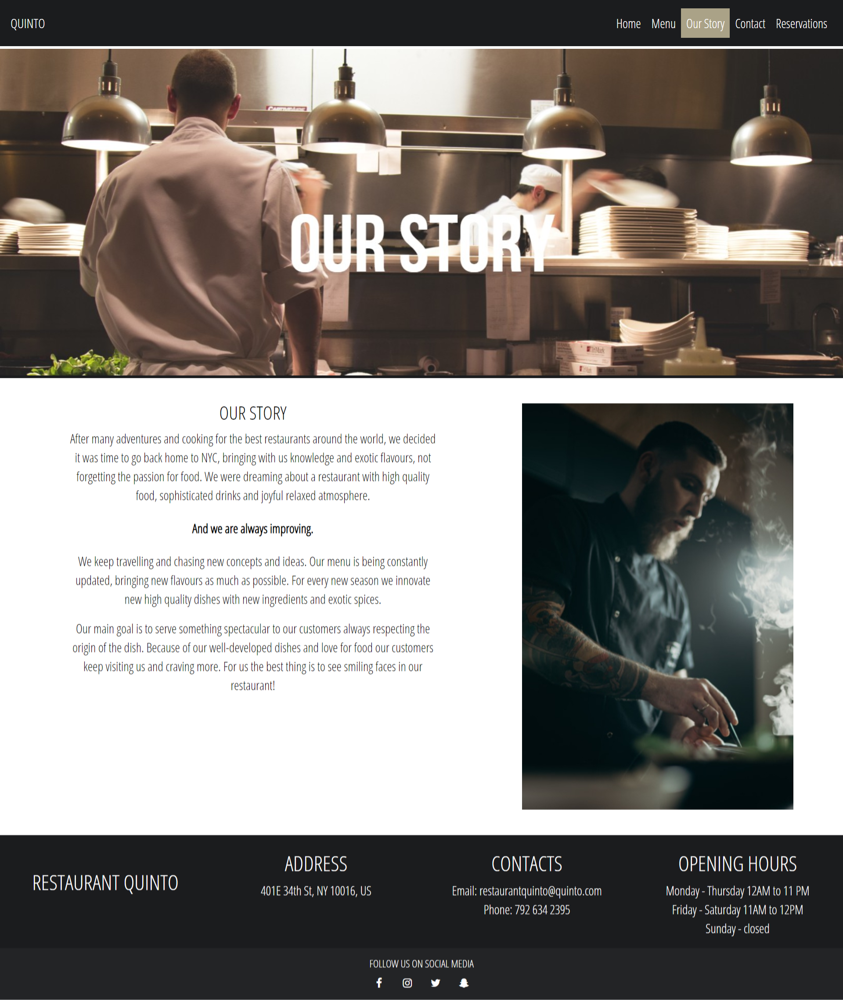
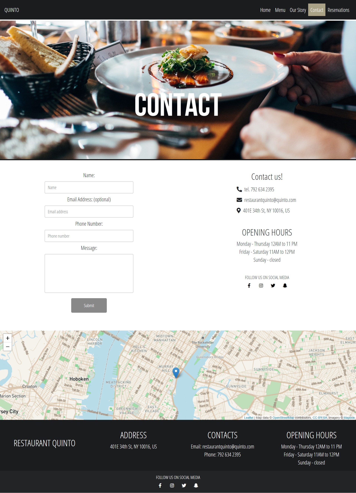
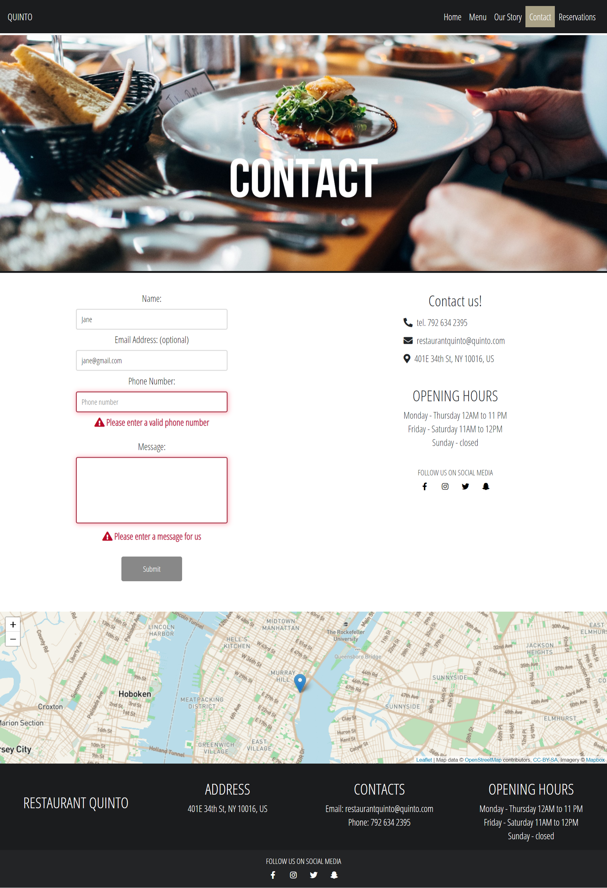
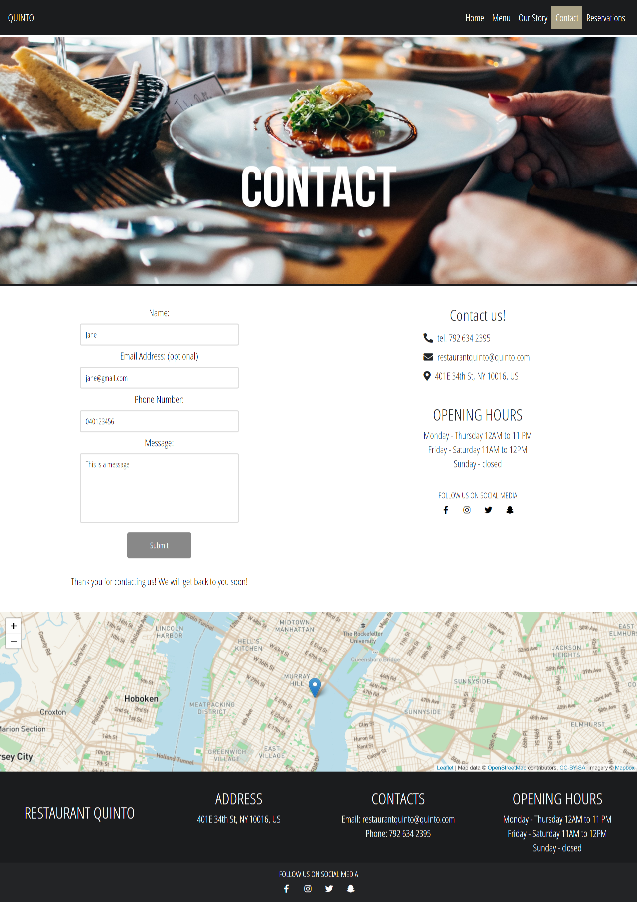
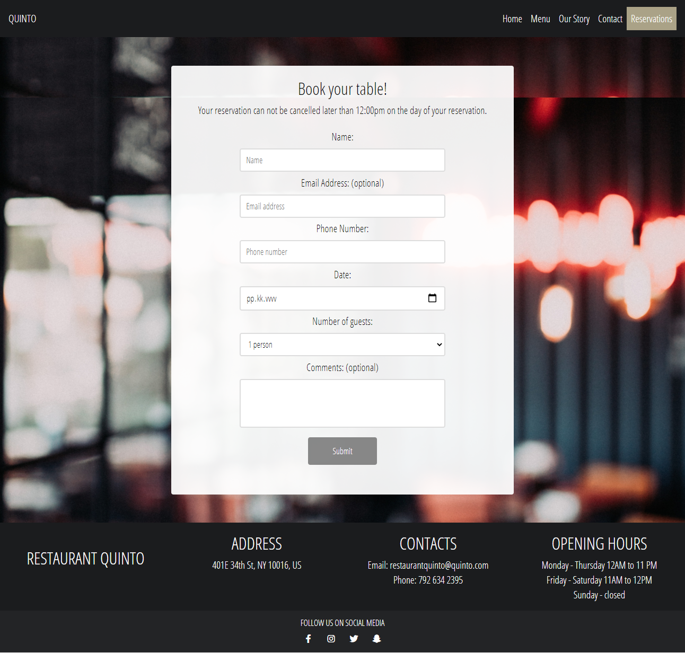
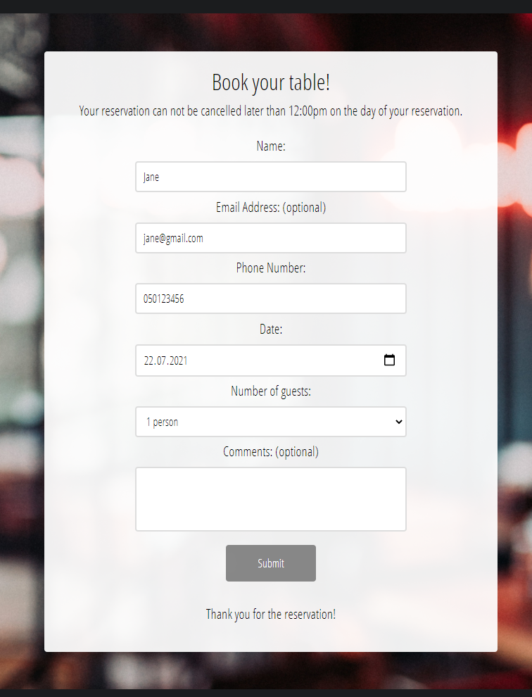

## Restaurant Quinto
You can visit the application [here](https://jennilehtonen.github.io/Restaurant-Quinto/). Note: the map in the contact page doesn't work because I have deleted its the access token.
The purpose of this project is to develop my skills in web developement (coding and UI). I also wanted to develop a website with multiple pages. This website consists of 5 pages: home, menu, our story, contact and reservations. This is my first own website project to which I have added new features when I have learned new technologies in school.

Used technologies: **HTML, CSS, JavaScript, jQuery and Bootstrap**. I have used JavaScript in contact and reservation forms and in scroll back to top button in the menu page. The function that shows to the user in which page they are is built with jQuery. The navigation bar is built with a ready Bootstrap template that I found on the internet.

This is the view when the user opens the page.

This is the menu that is built using flexbox.

Here the user can read the story of this imaginary restaurant.

Here the user can see the contact information and send messages to the restaurant by using the form.

This is how the form looks like when some of the mandatory information is missing.

This is how the form looks like when the form is successfully sent. (The form doesn't go anywhere because I have only built the front-end!)

Here the user can make a reservation.

This is how the form looks like when some of the mandatory information is missing.

This is how the form looks like when the form is successfully sent. (The form doesn't go anywhere because I have only built the front-end!)

